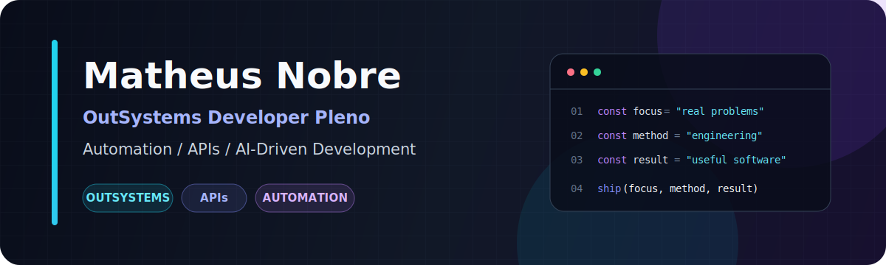

 

## Sobre

Sou desenvolvedor OutSystems pleno, com experiência profissional desde 2022
em aplicações web, interfaces responsivas, regras de negócio, SQL e
integrações via APIs REST.

Minha base em front-end me ajuda a conectar experiência do usuário e
implementação. Atualmente, amplio essa atuação com automação, arquitetura de
software e AI-Driven Development, aplicando agentes, skills, engenharia de
contexto, MCP e especificações ao processo de desenvolvimento.

- Atualmente: **Desenvolvedor OutSystems Pleno na Drakkar Brasil**
- Certificações: **Associate Reactive Developer** e
  **Front-end Developer Specialist**
- Formação: **Sistemas para Internet pela FIAP**
- Em evolução: **AI-Driven Development, arquitetura e cloud**

## Projeto principal

<table>
  <tr>
    <td width="70%">
      <h3>ReleasePilot AI</h3>
      

        Plataforma pública em desenvolvimento para centralizar qualidade,
        execuções automatizadas, evidências de testes, checklists de release
        e resumos assistidos por IA.
      

      

        O MVP já entrega um dashboard responsivo para quality gates,
        execuções automatizadas, risco de mudança e recomendação de release,
        acompanhado por testes, documentação de arquitetura e CI.
      

      

        <strong>Status:</strong> v0.1.0 funcional, com dados demonstrativos e
        mecanismo de análise determinístico preparado para uma futura
        integração com IA.
      

      

        <a href="https://github.com/mnnobre/releasepilot-ai">
          Ver código, arquitetura e roadmap
        </a>
      

    </td>
    <td width="30%" align="center">
      <strong>TypeScript</strong> 
      <strong>React</strong> 
      <strong>Vitest</strong> 
      <strong>Testing Library</strong> 
      <strong>GitHub Actions</strong>
    </td>
  </tr>
</table>

## Engenharia em foco

| Enterprise development | Automation & quality | AI-Driven Engineering |
| --- | --- | --- |
| OutSystems 11 | Playwright | Agents & skills |
| Reactive Web | GitHub Actions | Context engineering |
| SQL | Test automation | MCP |
| REST APIs | Release workflows | Spec-Driven Development |
| Integrações | Observabilidade | Prompt engineering |

## Stack

## Como eu trabalho

- Primeiro o problema e o contexto, depois a ferramenta.
- Arquitetura deve tornar mudanças mais simples, não apenas parecer sofisticada.
- Testes, segurança e observabilidade fazem parte da entrega.
- IA acelera o desenvolvimento quando contexto, limites e validação estão claros.
- Documentação deve explicar decisões, trade-offs e operação do sistema.

## Atividade

<picture>
  <source media="(prefers-color-scheme: dark)" srcset="https://raw.githubusercontent.com/mnnobre/mnnobre/output/github-snake-dark.svg">
  <source media="(prefers-color-scheme: light)" srcset="https://raw.githubusercontent.com/mnnobre/mnnobre/output/github-snake.svg">
  
</picture>

**OutSystems + APIs + Automation + AI-Driven Development**

